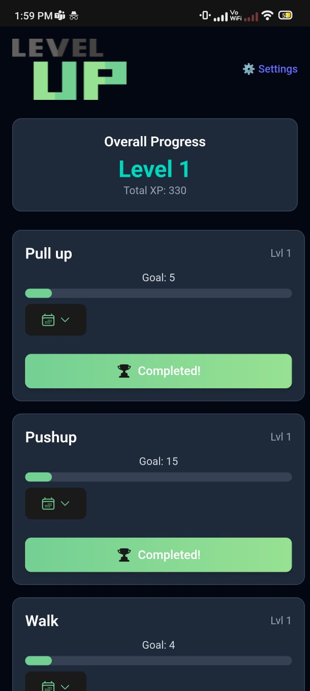

# 🧠 Levelup - Habit Tracker

A **gamified self-help PWA** built with **React**, **Vite**, and **Tailwind CSS** that helps you level up your life by completing daily habits and routines.

## 🚀 Features

- ✅ **Custom task creation** with initial goals
- 📈 **Level-up system**: tasks increase in difficulty as you progress
- 📆 **Calendar view**: see daily habit completion history
- 🧩 **Animated collapsible UI** for clean, mobile-friendly experience
- 🏆 **Game-inspired UI**: XP bars, progress badges, and completed states
- 📦 **LocalStorage-based persistence** — no backend required (yet!)
- 🌐 **Progressive Web App**: installable and offline-ready
- 🔔 **Browser notifications** for daily reminders *(experimental)*

---

## 🛠️ Tech Stack

- ⚛️ **React**
- ⚡ **Vite** (blazing fast bundler)
- 🎨 **Tailwind CSS** (utility-first styling)
- 🧠 **LocalStorage** for task storage
- 📅 **react-calendar** for history view
- 🧰 **Heroicons** for modern UI icons
- 🛎 **Notification API** (optional reminders)

---

## 📷 Preview




> Mobile-friendly and responsive out-of-the-box

---

## 📦 Installation

```bash
# Clone the repo
git clone https://github.com/mosh1331/levelup-habit-tracker
cd levelup-habit-tracker

# Install dependencies
npm install

# Start development server
npm run dev
